# Hearth - trusted services & experiences marketplace (Flutter + Riverpod)

Hearth is a two-sided **marketplace** mobile app for booking trusted local services -
massage, lessons, beauty and home pros. It is built to the "warm & human" Hearth iOS
design direction and demonstrates the full marketplace surface: **verified profiles,
search & filtering, booking, secure payment, reviews, in-app messaging, multi-currency,
push reminders and an admin / moderation console** - all running on realistic mockup
data with no backend required.


## What it shows

A complete trusted-marketplace experience, end to end:

| | | |
|---|---|---|
|  | 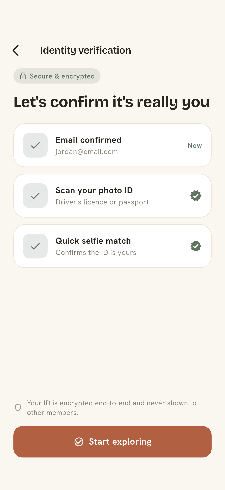 | 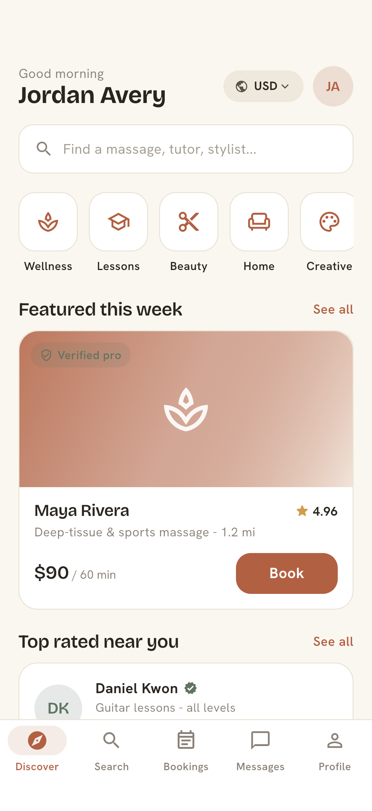 |
| **Onboarding** - Apple / email sign-in, trust messaging | **Identity verification** - email, photo-ID scan, selfie match (encrypted) | **Discover** - greeting, categories, featured & top-rated pros |
| 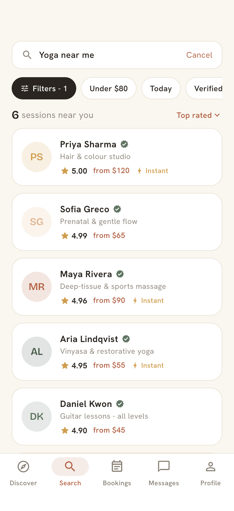 | 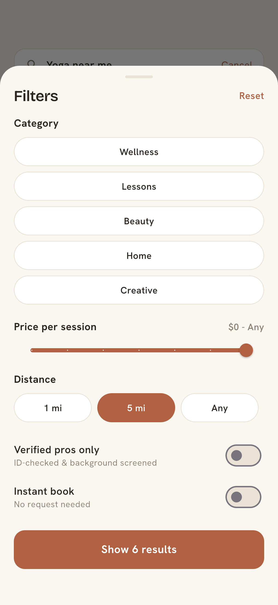 | 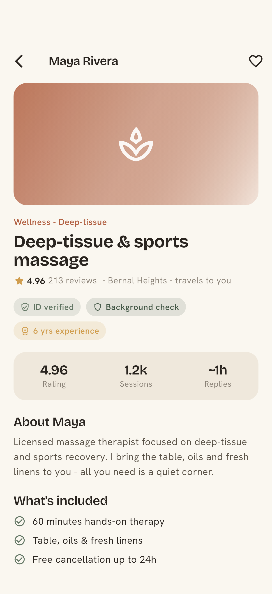 |
| **Search** - live results, filter chips, sort | **Filter sheet** - category, price, distance, verified-only, instant book | **Listing detail** - trust stats, what's included, session picker |
| 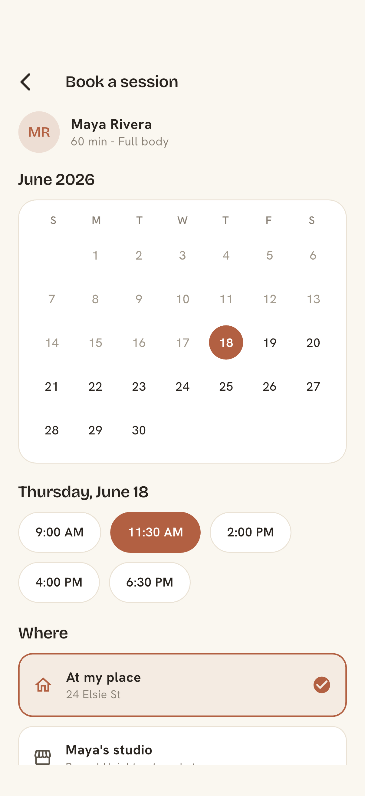 | 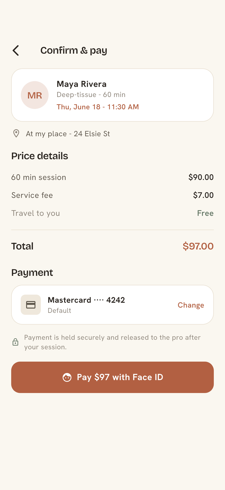 | 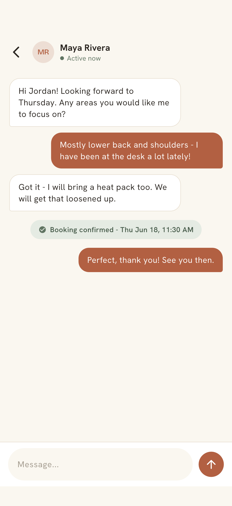 |
| **Booking** - date, time slots, location | **Confirm & pay** - price breakdown, Face ID pay, push reminder | **Messaging** - buyer/seller thread with live composer |
| 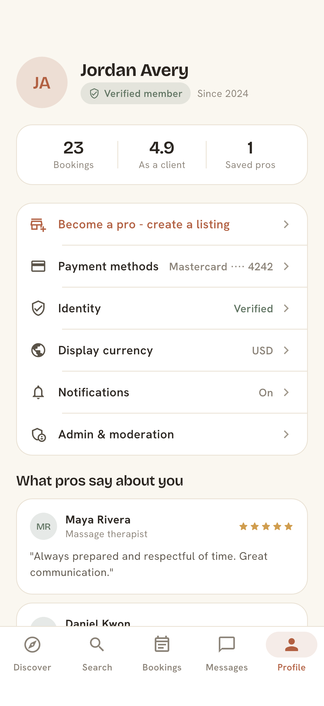 | 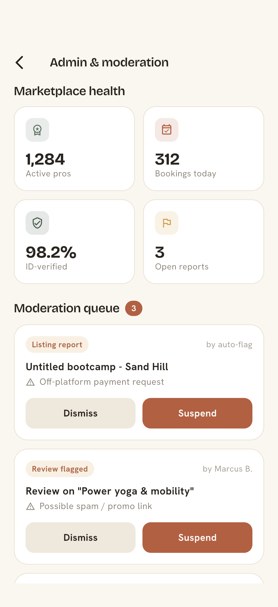 | |
| **Profile & reviews** - bookings, ratings, settings, "become a pro" | **Admin & moderation** - marketplace KPIs, report queue, suspend/dismiss | |

### Feature coverage

- **User registration & profiles** - Apple / email onboarding, member profile with stats and pro reviews.
- **User verification** - multi-step identity flow (email -> photo ID -> selfie match), with "ID-verified before booking" enforced across the marketplace and shown as trust badges on every listing.
- **Listing creation & management** - "Become a pro" create-listing flow (cover photos, category, sessions & pricing, publish for review).
- **Search & filtering** - text query, filter chips, and a full filter sheet (category, price slider, distance, verified-only, instant book) with live result counts.
- **Booking** - calendar + time-slot picker, at-my-place / studio location choice, draft state.
- **Secure payments** - price breakdown (session + service fee + travel), saved card, Face ID confirmation, funds held & released after the session.
- **Reviews & ratings** - listing reviews, "as a client" rating, "what pros say about you".
- **In-app messaging** - thread list + conversation with optimistic send and a booking-confirmed system pill.
- **Push notifications** - booking confirmation sets a 1h reminder (surfaced in the confirm sheet).
- **Multi-currency** - USD / EUR / GBP / SGD switcher that reformats every price app-wide.
- **Admin dashboard, reporting & moderation** - marketplace health KPIs and a moderation queue with dismiss / suspend actions.

## Architecture

- **Flutter** with **Riverpod** for state management.
- **Feature-first structure** under `lib/features/` (onboarding, discover, search, listing,
  booking, messages, bookings, profile, create, admin) with a shared `theme/`, `data/`
  and `widgets/` layer.
- **Design tokens** (`theme/hearth_theme.dart`) capture the Hearth palette - warm cream
  surfaces, terracotta actions, sage trust accents, gold ratings - with Bricolage
  Grotesque display + Hanken Grotesk body fonts.
- **Mockup data only** (`data/mock_data.dart`): listings, sessions, reviews, conversation
  and the moderation queue. No network, camera or hardware dependency - scans and payment
  are simulated behind a tap so the whole app is demoable on a bare simulator.
- **Derived state** with providers: filtered/sorted `searchResultsProvider`, per-listing
  selected session, booking draft, saved pros, selected currency, and a
  `StateNotifier` moderation queue.

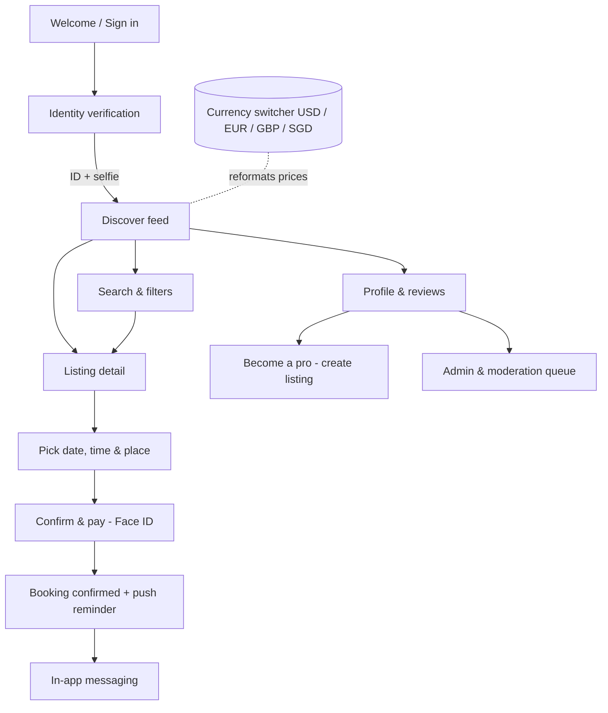

## Run

```bash
flutter pub get
flutter run -d "iPhone 17 Pro"
```

The app launches into onboarding. Sign in with Apple or email, complete the simulated
verification, and explore the marketplace. Switch currency from the Discover header or
the Profile screen; open **Profile -> Admin & moderation** for the operator console.
